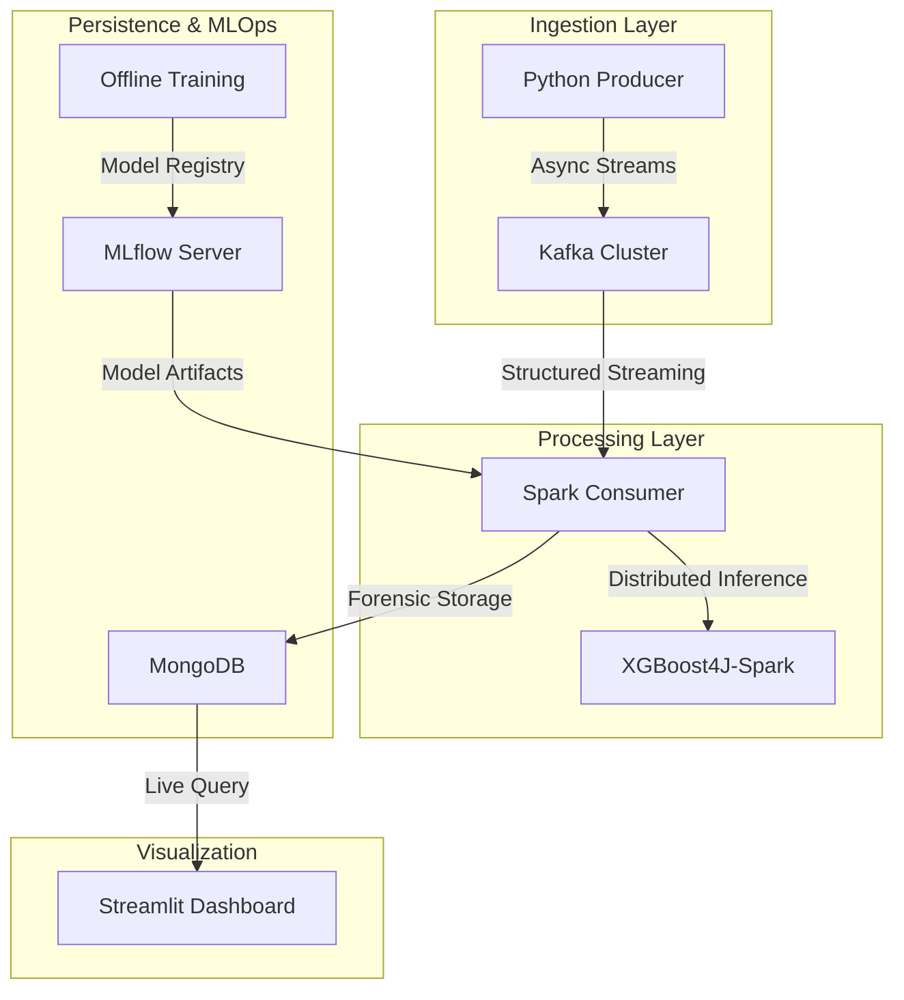

# FraudPulse: Real-Time Financial Fraud Detection Platform

## Platform Overview
FraudPulse is an advanced, production-grade data engineering platform designed to ingest, process, and analyze financial transactions in real-time to detect fraudulent activity. By leveraging a distributed microservices architecture, the platform ensures high availability, fault tolerance, and exactly-once processing semantics.

## Data Workflow Architecture

---

## Technology Stack and Justification

### Core Infrastructure
| Technology | Version | Purpose | Justification |
| :--- | :--- | :--- | :--- |
|  | 7.6.0 (KRaft) | Distributed Message Broker | Chosen for its high-throughput, low-latency capabilities and the modern KRaft mode which eliminates ZooKeeper dependency for simplified operations. |
|  | 3.5.1 | Distributed Stream Processing | Utilized for Structured Streaming, allowing for complex windowing operations and seamless integration with distributed machine learning libraries. |
|  | 7.0.8 | Forensic Document Store | Chosen for its flexible schema, which accommodates evolving transaction metadata and provides high-performance read/write operations for the dashboard. |

### Machine Learning & MLOps
| Technology | Version | Purpose | Justification |
| :--- | :--- | :--- | :--- |
|  | 2.0.3 | Gradient Boosting Classifier | Selected for its industry-leading accuracy in tabular data classification and its native Spark integration via XGBoost4J. |
|  | 2.13.0 | MLOps Lifecycle Management | Provides a centralized repository for experiment tracking, model versioning, and unified artifact deployment across the pipeline. |

### Application & Connectivity
| Technology | Version | Purpose | Justification |
| :--- | :--- | :--- | :--- |
|  | 3.11 | Logic and Scripting | The primary language for the Producer, ML training, and Dashboard due to its vast ecosystem of data science libraries. |
|  | 2.12 | Core Spark Engine | Used for the high-performance streaming consumer to leverage Spark's native object serialization and type safety. |
|  | 1.32.2 | Operational Dashboard | Enables rapid development of interactive, data-driven web applications directly from Python scripts. |
|  | 2.3.0 | Idempotent Producer | A C-based Python wrapper that provides the most reliable and high-performance interface for exactly-once Kafka production. |

---

## Detailed System Components

### 1. The Ingestion Layer (Python Producer)
The producer acts as a simulated data source, reading from the PaySim synthetic dataset. It utilizes the **Confluent-Kafka** library to implement **Idempotent Production**, ensuring that network retries never result in duplicate records in the broker. 
- **Role**: Continuous data emission with a controlled delay to simulate real-world transaction flow.
- **Why**: Essential for stress-testing the downstream processing cluster.

### 2. The Processing Engine (Spark Structured Streaming)
The heart of the platform is a Scala-based Spark application. It subscribes to the Kafka `fraud-transactions` topic and processes data in micro-batches.
- **Role**: Real-time feature engineering and model inference.
- **Why**: Spark's fault-tolerant checkpointing ensures that if the system crashes, it resumes exactly where it left off.

### 3. Machine Learning Inference (XGBoost4J)
The Spark cluster uses **XGBoost4J-Spark** to run distributed inference. The model is loaded dynamically from the `models/` directory, which is synchronized with the **MLflow Model Registry**.
- **Role**: Classifying each transaction as 'Legitimate' or 'Fraudulent' based on feature vectors.
- **Why**: XGBoost provides the necessary speed for real-time inference on high-volume streams.

### 4. Forensic Persistence (MongoDB)
All processed transactions, along with their fraud scores and original metadata, are stored in MongoDB.
- **Role**: Long-term storage for forensic analysis and dashboard queries.
- **Why**: Decoupling the storage layer from the processing layer allows the dashboard to scale independently.

### 5. Operational Dashboard (Streamlit)
The dashboard provides a high-level view of the platform's health and a detailed table of detected fraud alerts.
- **Role**: Real-time visualization for fraud investigators.
- **Why**: Interactive filters and live updates allow for rapid response to ongoing fraud attacks.

---

## Getting Started
For detailed setup instructions, including Docker configurations and environment variables, please refer to the **[Deployment Guide](./DEPLOYMENT_GUIDE.md)**.
