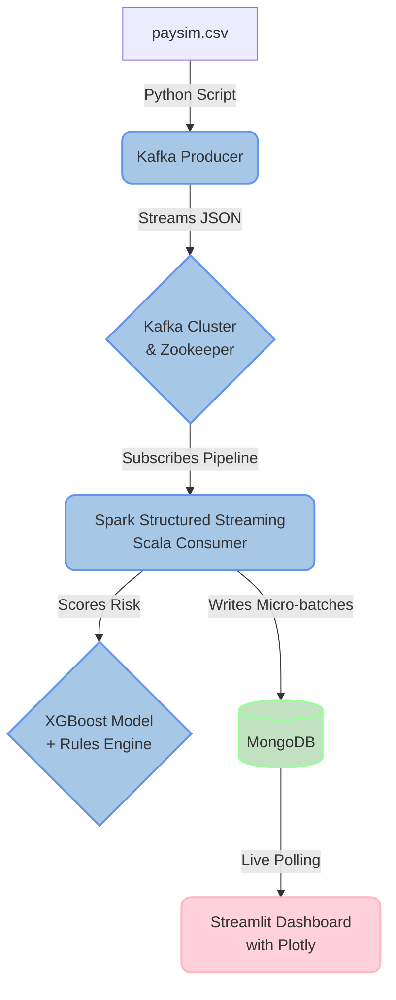

# FraudPulse

```text
  ___                    _ ____        _          
 | __| _ __ _ _  _  __| | _ \_  _| |___ ___ 
 | _| '_/ _` | || |/ _` |  _/ || | (_-</ -_)
 |_||_| \__,_|\_,_|\__,_|_|  \_,_|_/__/\___|
```

## Production-Grade Real-Time Fraud Detection Pipeline

FraudPulse is a robust, fault-tolerant data engineering pipeline designed to detect fraudulent mobile money transactions in real time. It processes high-throughput streams of transaction data using Apache Kafka, evaluates them against a pre-trained XGBoost model nested alongside a deterministic rule engine using Apache Spark Structured Streaming, and persists the evaluated results in MongoDB. A streamlined, auto-refreshing Streamlit dashboard provides live visibility into pipeline health and fraud metrics.

---

## Quick Start: Launching the Project

To immediately launch the streaming pipeline in a local environment, follow these three execution steps:

**1. Prepare the Data & Train the Model**
Download `paysim.csv` from Kaggle and place it in the core `data/` folder. Subsequently, generate the initial machine learning model:

```bash
python -m venv venv
source venv/bin/activate  # On Windows: .\venv\Scripts\activate
pip install -r src/ml/requirements.txt
python src/ml/train.py
```

**2. Start the Core Infrastructure**
Initialize the foundational streaming and storage layers (Kafka, Zookeeper, MongoDB), and provision the Kafka topics:

```bash
docker-compose up -d zookeeper kafka mongodb spark-master spark-worker
docker-compose up -d kafka-init
```

**3. Launch the Microservices**
Build and deploy the streaming producer, the real-time Scala-based Spark consumer, and the dashboard visualization layer:

```bash
docker-compose up --build -d spark-consumer dashboard producer
```

**View the Live Dashboard at: [http://localhost:8501](http://localhost:8501)**
*(Allow 30-60 seconds for the Spark engine to compile dependencies and process the initial micro-batch).*

---

## System Architecture



## Project Structure

```
FraudPulse/
├── src/
│   ├── producer/        # Kafka producer to publish transaction data
│   ├── spark/           # Spark Structured Streaming consumer logic (Scala)
│   ├── dashboard/       # Streamlit real-time reporting dashboard
│   └── ml/              # Model training and testing pipelines
├── models/              # Serialized model constraints and weights (.json)
├── data/                # Datasets (e.g. paysim.csv)
├── scripts/             # Orchestration and database initialization scripts
├── notebooks/           # Exploratory Jupyter Notebooks for EDA
└── docker-compose.yml   # Infrastructure definitions and networking
```

## Technology Stack

| Component | Technology | Version |
|-----------|------------|---------|
| **Streaming Broker** | Confluent Kafka & Zookeeper | `7.5.3` |
| **Stream Processing** | Apache Spark (Scala API) & Bitnami | `3.5.3` |
| **Database** | MongoDB | `6.0.12` |
| **Language** | Python (Producer, ML, Dashboard) & Scala (Spark) | `3.11-slim` / `2.12.18` |
| **Dashboard** | Streamlit & Plotly | `1.31.0` / `5.18.0` |
| **Machine Learning** | XGBoost & Scikit-learn | `2.0.3` / `1.4.0` |
| **Orchestration** | Docker Compose | N/A |

## Prerequisites

- [Docker](https://docs.docker.com/get-docker/) & Docker Compose
- Python 3.11 (Required for local model training)
- Over 8GB of RAM available for Docker (Spark and Kafka are highly memory-intensive processes)

---

## Production-Grade Setup Guide

To run this pipeline robustly—mirroring a strict production deployment sequence—you must bring the infrastructure online layer by layer, verifying dependencies before consumers and producers are initialized.

**1. Initial Setup & Data Acquisition**
Verify the Docker runtime is active with at least **8GB of RAM** allocated. 
Download the `paysim.csv` dataset from [Kaggle](https://www.kaggle.com/datasets/ealaxi/paysim1) and place it neatly in the `data/` directory.

**2. Train the XGBoost Model (Offline Stage)**
Prior to Spark stream initialization, the engine requires the serialized `fraud_model.json` and `feature_cols.json` assets. In a production environment, this is managed via CI/CD pipelines (e.g., Airflow); locally, execute the `ml` module:

```bash
# Create and activate a virtual environment
python -m venv venv
source venv/bin/activate    # On Windows: .\venv\Scripts\activate

# Install training requirements and execute the pipeline
pip install -r src/ml/requirements.txt
python src/ml/train.py
python src/ml/evaluate.py
```
*(Verify that `models/fraud_model.json` and `models/feature_cols.json` were generated successfully).*

**3. Initialize the State & Storage Layer**
Deploy message brokers and persistence layers before activating processing engines:

```bash
docker-compose up -d zookeeper kafka mongodb
```
*(Allow approximately 15 seconds for these clusters to initialize).*

**4. Provision Configurations**
Trigger the topic creation script. This provisions the target Kafka topic `fraud-transactions` with exactly 3 partitions for horizontal parallelism:

```bash
docker-compose up -d kafka-init
```

**5. Launch the Processing Engine (Apache Spark)**
Boot both the master orchestrator and the worker execution node:

```bash
docker-compose up -d spark-master spark-worker
```

**6. Build and Deploy Consumers, Dashboard, and Producers**
Build the custom microservices. The Scala Spark streaming job will require ~60 seconds to execute the first build, as `sbt` retrieves Scala dependencies and compiles `FraudPulseStream.scala` into an executable `.jar` directly inside the container instance.

```bash
docker-compose up --build -d spark-consumer dashboard producer
```

**7. Monitor the Pipeline**
The pipeline is now successfully streaming. Monitor its operations via standard engineering practices:
- **View the Live Dashboard:** Access **[http://localhost:8501](http://localhost:8501)**. The UI polls MongoDB and auto-refreshes continuously.
- **Inspect Scala Consumer Logs:** Verify Spark micro-batch processing gracefully:
  ```bash
  docker-compose logs -f spark-consumer
  ```
- **Inspect Producer Throughput:**
  ```bash
  docker-compose logs -f producer
  ```

**8. Graceful Production Shutdown vs. Hard Reset**
- **Graceful Pause:** To pause the pipeline, allowing Spark to utilize its existing Checkpoint data upon restart, execute:
  ```bash
  docker-compose stop
  ```
- **Development Wipe:** To fully purge MongoDB data, wipe Kafka partitions, and delete Spark staging files, dropping back to a blank state:
  ```bash
  bash scripts/reset.sh
  ```

---

## Troubleshooting Guide

1. **Error: `kafka-init` exits with code 1**
   - *Resolution:* Kafka initialization inherently delays slightly. `kafka-init` executes retries, but if permanent failure occurs, verify Docker's memory allocation limits.
2. **Error: Spark container crash `java.lang.OutOfMemoryError`**
   - *Resolution:* Increase the Docker Engine limit to 8GB minimum. Alternatively, reduce `SPARK_WORKER_MEMORY` directly in `docker-compose.yml`.
3. **Error: Consumer logs `Error loading model context`**
   - *Resolution:* Ensure `python src/ml/train.py` was explicitly executed. The `/models` directory must be fully populated prior to the `docker-compose build` step.
4. **Dashboard Shows "MongoDB Connection Error"**
   - *Resolution:* Allow 10-20 seconds for the engine to initialize replica sets. The dashboard will automatically reconnect once active.
5. **No Visual Data Rendering on Dashboard**
   - *Resolution:* Inspect the `producer` logs. Verify the source dataset is accurately titled `paysim.csv` and situated in the `data/` branch.

---

## Feature Summary and System Capabilities

1. **Fault-Tolerant Processing:** Employs checkpointing semantics enabling Docker node failures to resume gracefully without data loss or duplication offset issues.
2. **Dual-Layer Scoring System:** Processes real-time transactions utilizing both a deterministic backend rules-engine and a probability-driven XGBoost classifier acting as parallel processing constraints.
3. **Production Simulation:** Incorporates exponential backoffs, asynchronous messaging, and containerized dependencies mimicking exact tier-1 financial architectures.

**Proposed Future Scalability Plans:**
1. **Model Registry & Hot Swapping:** Implement MLflow registries replacing static `.json` injections, enabling seamless model redeployment vectors without process interruption.
2. **Confluent Schema Registry:** Introduce centralized Avro/Protobuf protocols overriding un-typed JSON transfers to prevent downstream Spark transformation pipeline breakages.
3. **Stateful Windowing Capabilities:** Integrate advanced Spark watermarking functions for aggregate temporal metrics (monitoring velocity per entity over sliding 10-minute intervals).
