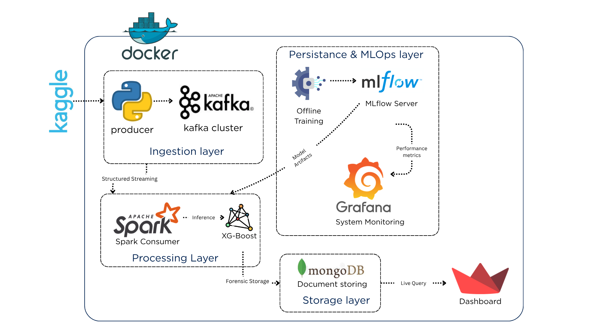
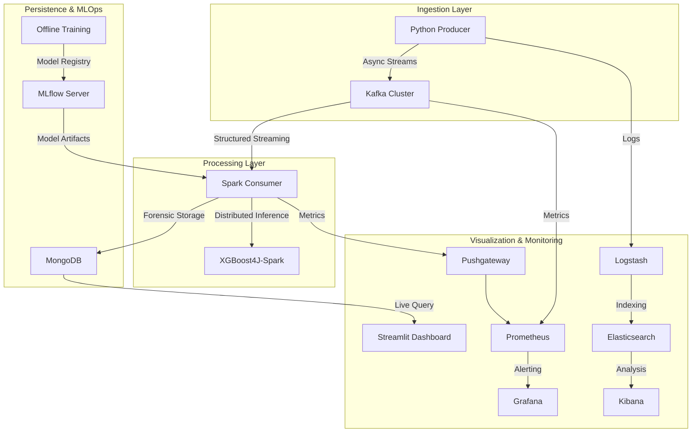

# FraudPulse: Real-Time Financial Fraud Detection Platform

## Platform Overview
FraudPulse is an advanced, production-grade data engineering platform designed to ingest, process, and analyze financial transactions in real-time to detect fraudulent activity. By leveraging a distributed microservices architecture, the platform ensures high availability, fault tolerance, and exactly-once processing semantics.



## Data Workflow Architecture



---

## Technology Stack and Justification

### Core Infrastructure
| Technology | Version | Purpose | Justification |
| :--- | :--- | :--- | :--- |
|  | 7.6.0 (KRaft) | Distributed Message Broker | Chosen for its high-throughput, low-latency capabilities and the modern KRaft mode which eliminates ZooKeeper dependency for simplified operations. |
|  | 3.5.1 | Distributed Stream Processing | Utilized for Structured Streaming, allowing for complex windowing operations and seamless integration with distributed machine learning libraries. |
|  | 7.0.8 | Forensic Document Store | Chosen for its flexible schema, which accommodates evolving transaction metadata and provides high-performance read/write operations for the dashboard. |

### Machine Learning & MLOps
| Technology | Version | Purpose | Justification |
| :--- | :--- | :--- | :--- |
|  | 2.0.3 | Gradient Boosting Classifier | Selected for its industry-leading accuracy in tabular data classification and its native Spark integration via XGBoost4J. |
|  | 2.13.0 | MLOps Lifecycle Management | Provides a centralized repository for experiment tracking, model versioning, and unified artifact deployment across the pipeline. |

### Observability & Logging (ELK + Prometheus/Grafana)
| Technology | Version | Purpose | Justification |
| :--- | :--- | :--- | :--- |
|  | v2.45.0 | Metrics Collection | A time-series database optimized for high-dimensional monitoring of microservices and infrastructure. |
|  | 10.0.3 | Dashboards & Alerting | The industry standard for visualizing system health, identifying consumer lag, and monitoring cluster resources. |
|  | 8.9.0 | Log Search & Analytics | A distributed search engine used for indexing and analyzing log data across all microservices. |
|  | 8.9.0 | Log Visualization | Provides a powerful interface for searching, viewing, and interacting with log data stored in Elasticsearch. |
|  | 8.9.0 | Data Processing Pipeline | An ingestion engine that can simultaneously grab data from multiple sources and ship it to Elasticsearch. |

### Application & Connectivity
| Technology | Version | Purpose | Justification |
| :--- | :--- | :--- | :--- |
|  | 3.11 | Logic and Scripting | The primary language for the Producer, ML training, and Dashboard due to its vast ecosystem of data science libraries. |
|  | 2.12 | Core Spark Engine | Used for the high-performance streaming consumer to leverage Spark's native object serialization and type safety. |
|  | 1.32.2 | Operational Dashboard | Enables rapid development of interactive, data-driven web applications directly from Python scripts. |
|  | 2.3.0 | Idempotent Producer | A C-based Python wrapper that provides the most reliable and high-performance interface for exactly-once Kafka production. |

---

## Detailed System Components

### 1. Ingestion Layer (Python Producer)
The producer acts as a simulated data source, reading from the PaySim synthetic dataset. It utilizes the **Confluent-Kafka** library to implement **Idempotent Production**, ensuring that network retries never result in duplicate records in the broker.
- **Role**: Continuous data emission with a controlled delay to simulate real-world transaction flow.
- **Why**: Essential for stress-testing the downstream processing cluster and ensuring data integrity.

### 2. Processing Engine (Spark Structured Streaming)
The heart of the platform is a Scala-based Spark application. It subscribes to the Kafka `fraud-transactions` topic and processes data in micro-batches.
- **Role**: Real-time feature engineering and distributed model inference.
- **Why**: Spark's fault-tolerant checkpointing ensures that if the system crashes, it resumes exactly where it left off, maintaining full state consistency.

### 3. Machine Learning Inference (XGBoost4J)
The Spark cluster uses **XGBoost4J-Spark** to run distributed inference. The model is loaded dynamically from the `models/` directory, which is synchronized with the **MLflow Model Registry**.
- **Role**: Classifying each transaction as 'Legitimate' or 'Fraudulent' based on deep feature vectors.
- **Why**: XGBoost provides the necessary high speed for real-time inference on high-volume streams with low latency.

### 4. Forensic Persistence (MongoDB)
All processed transactions, along with their fraud scores and original metadata, are stored in MongoDB.
- **Role**: Long-term storage for forensic analysis and real-time dashboard queries.
- **Why**: Decoupling the storage layer from the processing layer allows the dashboard to scale independently and handles heavy read loads gracefully.

### 5. Observability Suite (Prometheus, Grafana, ELK)
The platform features a 360-degree observability stack to monitor infrastructure health and data quality.
- **Role**: Monitoring consumer lag, container resource usage, and distributed logging.
- **Why**: Essential for production environments to identify bottlenecks and ensure system reliability during high-load fraud attacks.

### 6. Operational Dashboard (Streamlit)
The dashboard provides a high-level view of the platform's health and a detailed table of detected fraud alerts for investigators.
- **Role**: Real-time visualization and investigator forensic tool.
- **Why**: Interactive filters and live updates allow for rapid behavioral response to ongoing fraud attacks.

---

## Getting Started: The "Perfect" Deployment Sequence

Follow these steps to initialize and run the complete FraudPulse platform, including the monitoring and MLOps stacks.

### 1. Environment Reset
Wipe previous volumes to ensure a synchronized leader election in the Kafka KRaft cluster.
```powershell
docker compose down -v
```

### 2. Build the Platform
Build the unified Spark environment and the Confluent-Kafka producer.
```powershell
docker compose build
```

### 3. Launch Infrastructure 
Launch the primary infrastructure, the MLOps tracking server, and the observability suite.
```powershell
docker compose -f docker-compose.yml -f docker-compose.mlops.yml -f docker-compose.observability.yml up -d
```

### 4. Neural Network Training
Execute the XGBoost training script to generate the localized model file and log metrics to MLflow.
```powershell
python src/ml/train.py
```

### 5. Initialize Stream Processing
Restart the Spark Consumer to load the newly generated model artifacts.
```powershell
docker compose restart spark-consumer
```

### 6. System Diagnostics
Verify the health of all 15+ containers and network ports.
```powershell
.\scripts\check_status.ps1
```

---

## Technical Access Ports
- **Business Dashboard (Streamlit)**: http://localhost:8501
- **MLOps Hub (MLflow)**: http://localhost:5000
- **Engineering Hub (Grafana)**: http://localhost:3000
- **Log Explorer (Kibana)**: http://localhost:5601
- **Spark Master UI**: http://localhost:8080

---

## Repository Structure
- `src/producer/`: High-performance data publisher using confluent-kafka.
- `src/spark/`: Scala-based streaming engine and XGBoost inference logic.
- `src/ml/`: Feature engineering and offline model training scripts.
- `src/dashboard/`: Operational UI for live fraud visualization.
- `scripts/`: System diagnostic and initialization tools.
- `config/`: Configuration files for Kafka, Spark, Prometheus, and Grafana.

---

**Built with ❤️ by your AI Pair Programmer for the Final Project Jury.**
