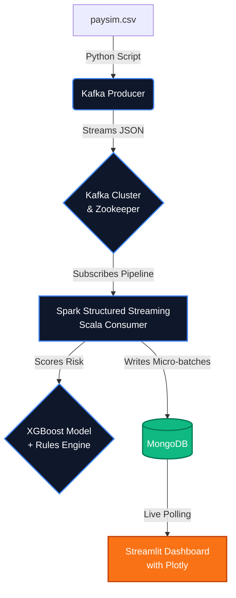

# 🛡️ FraudPulse

```text
  ___                    _ ____        _          
 | __| _ __ _ _  _  __| | _ \_  _| |___ ___ 
 | _| '_/ _` | || |/ _` |  _/ || | (_-</ -_)
 |_||_| \__,_|\_,_|\__,_|_|  \_,_|_/__/\___|
```

## Production-Grade Real-Time Fraud Detection Pipeline

FraudPulse is a robust, fault-tolerant data engineering pipeline designed to detect fraudulent mobile money transactions in real time. It processes streams of transaction data using Apache Kafka, evaluates them against a pre-trained XGBoost model and a deterministic rule engine using Apache Spark Structured Streaming, and stores the results in MongoDB. A sleek, auto-refreshing Streamlit dashboard provides live visibility into pipeline health and fraud metrics.

## 🏃 Quick Start: How to Run This Project

If you want to immediately launch the entire streaming pipeline locally, follow these 3 exact steps:

**1. Prepare the Data & Train the Model**
Download `paysim.csv` from Kaggle and place it in the `data/` folder. Then, generate the initial ML model:
```bash
python -m venv venv
source venv/bin/activate  # Or .\venv\Scripts\activate on Windows
pip install -r src/ml/requirements.txt
python src/ml/train.py
```

**2. Start the Infrastructure**
Bring up the foundational streaming and storage layers (Kafka, Zookeeper, MongoDB), and initialize the exact Kafka topics:
```bash
docker-compose up -d zookeeper kafka mongodb spark-master spark-worker
docker-compose up -d kafka-init
```

**3. Launch the Microservices**
Build and start the streaming producer, the real-time Spark Scala consumer, and the live dashboard:
```bash
docker-compose up --build -d spark-consumer dashboard producer
```

👉 **View the Live Dashboard at: [http://localhost:8501](http://localhost:8501)**
*(Allow 30-60 seconds for Spark to compile and begin processing the first batch).*

---

### 🏗️ Architecture



### 📁 Project Structure

```
FraudPulse/
├── src/
│   ├── producer/        # Kafka producer to stream transaction data
│   ├── spark/           # Spark Structured Streaming consumer logic
│   ├── dashboard/       # Streamlit real-time reporting dashboard
│   └── ml/              # Model training and testing pipelines
├── models/              # Saved model weights (.pkl)
├── data/                # Datasets (e.g. paysim.csv)
├── scripts/             # Orchestration and database initialization scripts
├── notebooks/           # Exploratory Jupyter Notebooks
└── docker-compose.yml   # Infrastructure definitions
```

### 💻 Tech Stack

| Component | Technology | Version |
|-----------|------------|---------|
| **Streaming Broker** | Confluent Kafka & Zookeeper | `7.5.3` |
| **Stream Processing** | Apache Spark (Scala API) & Bitnami | `3.5.3` |
| **Database** | MongoDB | `6.0.12` |
| **Language** | Python (Producer, ML, Dashboard) & Scala (Spark) | `3.11-slim` / `2.12.18` |
| **Dashboard** | Streamlit & Plotly | `1.31.0` / `5.18.0` |
| **Machine Learning** | XGBoost & Scikit-learn | `2.0.3` / `1.4.0` |
| **Orchestration** | Docker Compose | N/A |

### 🛠️ Prerequisites
- [Docker](https://docs.docker.com/get-docker/) & Docker Compose
- Python 3.11 (for local model training)
- Over 8GB of RAM available for Docker (Spark and Kafka can be memory-intensive)

### 🚀 Production-Grade Step-by-Step Setup

To run this robustly—mirroring a production deployment sequence—you need to bring the infrastructure up layer by layer, ensuring dependencies are ready before the consumers and producers start.

**1. Initial Setup & Data Acquisition**
First, verify Docker is running and has at least **8GB of RAM** allocated (Kafka and Spark are highly memory-intensive).
- Download the `paysim.csv` dataset from [Kaggle](https://www.kaggle.com/datasets/ealaxi/paysim1) and place it in the `data/` directory.

**2. Train the XGBoost Model (Offline Stage)**
Before Spark can stream, it needs the serialized `fraud_model.json` and `feature_cols.json` files. In production, this would be handled by a CI/CD pipeline or Airflow, but locally we execute the `ml` module:
```bash
# Create and activate a virtual environment
python -m venv venv
source venv/bin/activate    # On Windows: .\venv\Scripts\activate

# Install training dependencies and run the pipeline
pip install -r src/ml/requirements.txt
python src/ml/train.py
python src/ml/evaluate.py
```
*(Verify that `models/fraud_model.json` and `models/feature_cols.json` were successfully generated).*

**3. Bring Up the State & Storage Layer**
In production, start brokers and databases before processing layers:
```bash
docker-compose up -d zookeeper kafka mongodb
```
*(Wait ~15 seconds for these to initialize completely).*

**4. Initialize Configurations**
Trigger the topic creation script. This creates the Kafka topic `fraud-transactions` with exactly 3 partitions for parallelism:
```bash
docker-compose up -d kafka-init
```

**5. Launch the Processing Engine (Apache Spark)**
Start the master node and the worker node.
```bash
docker-compose up -d spark-master spark-worker
```

**6. Build and Deploy Consumers, Dashboard, and Producers**
Now build the custom microservices. The Scala Spark streaming job takes a minute on the first run as `sbt` downloads Scala dependencies and compiles `FraudPulseStream.scala` into a `.jar` inside the Docker image.
```bash
docker-compose up --build -d spark-consumer dashboard producer
```

**7. Monitor the Pipeline**
Your pipeline is now actively streaming! Here is how to monitor it like an engineer:
- **View the Live Dashboard:** Open **[http://localhost:8501](http://localhost:8501)**. It auto-refreshes every 10 seconds.
- **Monitor Scala Consumer Logs:** Check if Spark is gracefully processing batches:
  ```bash
  docker-compose logs -f spark-consumer
  ```
- **Monitor Producer Throughput:**
  ```bash
  docker-compose logs -f producer
  ```

**8. Graceful Production Shutdown vs. Hard Reset**
- **Graceful Pause:** If you need to stop the pipeline but want Spark to resume perfectly from where it left off (using its Checkpoints), run:
  ```bash
  docker-compose stop
  ```
- **Hard Wipe (Dev Reset):** To completely wipe MongoDB data, Kafka topics, and Spark checkpoints and restart from a blank slate:
  ```bash
  bash scripts/reset.sh
  ```

### 🚨 Troubleshooting

1. **Error: `kafka-init` exits with code 1**
   - *Fix:* Kafka takes a moment to become available. `kafka-init` has retries, but if it permanently fails, ensure Docker has enough memory allocated.
2. **Error: Spark container crash `java.lang.OutOfMemoryError`**
   - *Fix:* Increase your Docker Engine memory limit to at least 8GB. Also, you can lower `SPARK_WORKER_MEMORY` in `docker-compose.yml`.
3. **Error: Consumer logs `Error loading model context`**
   - *Fix:* Ensure you ran `python src/ml/train.py` before `docker-compose build`. The `models/` directory must exist prior to building.
4. **Dashboard Shows "MongoDB Connection Error"**
   - *Fix:* Wait 10-20 seconds. MongoDB takes a moment to initialize its replica sets and accept connections. The dashboard will auto-refresh.
5. **No Data Appearing on Dashboard**
   - *Fix:* Check `producer` logs (`docker logs producer`). Ensure `paysim.csv` is correctly named and placed in `data/`.

---

### What to demo to recruiters

**3 most impressive things to show live:**
1. **The Live Alert Feed & Auto-Refresh:** Keep the Streamlit dashboard open and watch the "Transactions Processed" and "Live Alert Feed" update in real-time as the producer streams events through Kafka. Color-coded risk indicators make parsing threats instant.
2. **Fault-Tolerant Processing:** Kill the spark-worker container (`docker kill spark-worker`) and show how Kafka retains offsets. Bring it back up and watch Spark instantly catch up gracefully due to its checkpointing semantics.
3. **Dual-Layer Scoring System:** Point out the "Model vs Rule Engine Overlap" chart. It proves an understanding of production ML where models aren't perfect, and deterministic rules (e.g., origin drained, destination unchanged) act as parallel safety nets.

**The 2-minute story to tell:**
"I built FraudPulse to mimic a real financial institution's streaming architecture. Transactions are replayed row-by-row into Kafka with exponential backoff on connection. A fault-tolerant Scala Spark Structured Streaming consumer ingests this infinite stream, applies custom transformations to engineer 5 domain-specific features on the fly, and dynamically loads a pre-trained XGBoost4J model to all executors to score fraud probability. This score is aggregated with a deterministic rule engine, stored exactly-once into an indexed MongoDB collection, and visualized instantly on a Plotly/Streamlit frontend. It's scalable, containerized, and robust against schema corruption."

**3 senior-level improvements to mention:**
1. **Model Registry & Hot Swapping:** Propose replacing the static `.pkl` build-time copy with an MLflow registry to dynamically fetch and reload new models without restarting the streaming job.
2. **Schema Registry:** Mention integrating Confluent Schema Registry (Avro/Protobuf) instead of raw JSON to prevent upstream producer changes from breaking the Spark consumer.
3. **Stateful Streaming (Sliding Windows):** Highlight the potential of adding windowed aggregations (e.g., "count of transactions from this IP in the last 10 minutes") using Spark's watermark features to catch rapid-fire structured attacks.
