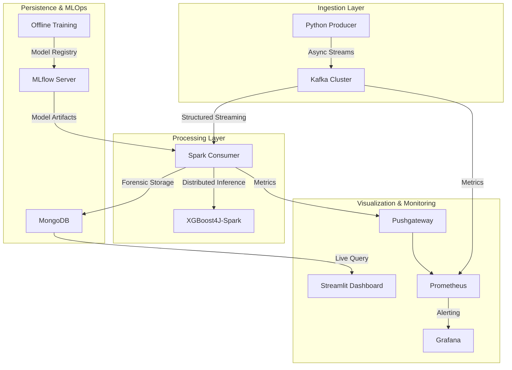

# FraudPulse
### Real-Time Fraud Detection Pipeline


A streaming pipeline that ingests financial transactions, scores them for fraud with a trained classifier, and surfaces flagged activity on a live dashboard — built to work through the full anatomy of a real-time ML system: ingestion, distributed processing, model serving, and observability.

</div>

---

##  Overview

FraudPulse combines Kafka, Spark, XGBoost, and MongoDB into a streaming fraud-detection pipeline, with a Streamlit dashboard for reviewing flagged transactions. Below is an honest breakdown of what's built and validated versus what's implemented but still being pushed toward full production load — so the scope is clear at a glance.

##  Architecture




##  Built & validated end-to-end

| Piece | What it does |
|---|---|
|  **Producer → Kafka** | Python producer (`confluent-kafka`) streams transactions from the PaySim dataset into a Kafka topic, using idempotent production to avoid duplicate records on retry |
|  **Model training** | XGBoost classifier trained and evaluated on PaySim, with experiments tracked in `notebooks/` |
|  **MongoDB storage** | Scored transactions persisted for forensic querying |
|  **Streamlit dashboard** | Live view of flagged transactions for investigators |
|  **Containerized services** | Producer, MongoDB, and dashboard run via Docker Compose |

##  Built, in progress toward full validation

- **Spark Structured Streaming (Scala)** — a distributed XGBoost4J inference consumer in `src/spark/` that subscribes to the Kafka topic for real-time scoring. The architecture is in place; the next milestone is load-testing it under sustained streaming throughput and publishing real latency numbers.
- **MLflow / Prometheus / Grafana / ELK** — the full observability and MLOps stack is configured (`docker-compose.mlops.yml`, `docker-compose.observability.yml`); next step is running it long enough to generate real dashboards and alerting data.

## 🛠️ Stack

| Layer | Technology |
|---|---|
| Ingestion | Apache Kafka (KRaft mode), confluent-kafka |
| Processing | Apache Spark Structured Streaming (Scala) |
| ML | XGBoost, XGBoost4J-Spark |
| Storage | MongoDB |
| Dashboard | Streamlit |
| Observability | Prometheus, Grafana, ELK |

##  Quickstart

```bash
docker compose down -v
docker compose build
docker compose up -d
python src/ml/train.py
docker compose restart spark-consumer
```

| Service | URL |
|---|---|
| Dashboard | `localhost:8501` |
| MLflow | `localhost:5000` |
| Spark UI | `localhost:8080` |

##  Structure

```
src/
├── producer/     → Kafka producer
├── spark/        → Scala streaming consumer + inference
├── ml/           → training & feature engineering
└── dashboard/    → Streamlit app
notebooks/        → EDA & model experiments
scripts/, config/ → diagnostics & service config
```

##  Roadmap

- [ ] Load-test the Spark consumer under sustained throughput and publish real numbers
- [ ] Automated tests for producer + dashboard logic
- [ ] Bring the observability stack fully online with live monitoring data

##  Why I built this

I wanted real, working exposure to every layer of a streaming ML system — not just the theory. The ingestion, model training, storage, and dashboard layers all run end-to-end today; the distributed streaming inference layer is what I'm actively taking through load testing next.

