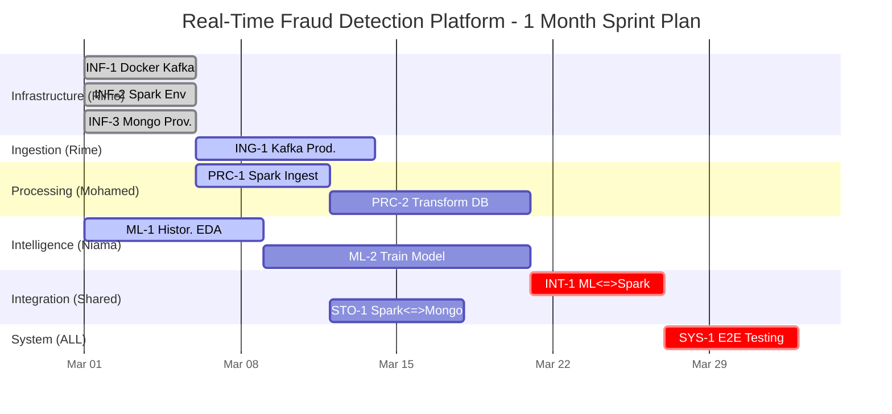

# Enterprise Project Management Plan: Real-Time Fraud Detection Platform

## Executive Summary
This document outlines the comprehensive project management strategy for the Real-Time Fraud Detection pipeline. It adopts an Agile methodology, structuring the work via Kanban boards, sprints, and detailed component ownership. The core architecture integrates standard big data components including **Docker, Apache Kafka, Apache Spark, MongoDB, and Machine Learning**.

---

## Team Roles & Responsibilities

| Team Member | Domain Ownership | Responsibilities |
| :--- | :--- | :--- |
| **Rime AABIL** | Data Ingestion & Infrastructure | Container orchestration (Docker), Streaming setup (Kafka/Zookeeper), Data Producer development. |
| **Mohamed EL BAGHDADI**| Distributed Processing | Apache Spark infrastructure, real-time data transformations, streaming aggregations, model integration. |
| **Niama EL MIZ** | Intelligence & Storage | MongoDB architecture, Exploratory Data Analysis (EDA), Machine Learning modeling |

---

## 1. Work Breakdown Structure (WBS)

The WBS is a hierarchical decomposition of the project architecture into manageable deliverables.

* **1.0 Data Ingestion & Streaming Infrastructure (Owner: Rime)**
  * 1.1 Infrastructure Orchestration: Docker Compose configurations for the entire ecosystem.
  * 1.2 Streaming Core: Zookeeper and Kafka cluster provisioning.
  * 1.3 Data Producer: Python-based data simulator/fetcher for financial transactions.
* **2.0 Distributed Processing Pipeline (Owner: Mohamed)**
  * 2.1 Spark Ecosystem: Spark cluster setup and master/worker configuration.
  * 2.2 Streaming Ingestion: Spark Structured Streaming reading from Kafka topics.
  * 2.3 Data Transformation: Schema enforcement, cleaning, and real-time feature engineering (windowing, aggregations).
* **3.0 Intelligence & Storage (Owner: Niama)**
  * 3.1 Pre-modeling: Exploratory Data Analysis (EDA) on historical fraud data.
  * 3.2 Machine Learning: Model training, tuning, and serialization (e.g., Random Forest, XGBoost) for fraud detection.
  * 3.3 Persistent Storage: MongoDB schema design and cluster configuration for raw data and fraud alerts.
* **4.0 System Integration & Production (Shared)**
  * 4.1 Pipeline Integration: Appending the ML model to the Spark Streaming pipeline.
  * 4.2 Data Sink: Spark writing classified streams to MongoDB.
  * 4.3 End-to-End Testing: Throughput testing and fault-tolerance verification.

---

## 2. Kanban Board (Detailed Task Tracking)

> [!TIP]
> This represents the initial state of the project backlog. In Jira/Trello, these would be tracked across columns.

### To Do / Backlog

| Epic | Task ID/Type | Summary | Assignee | Priority | Est. Time | Dependencies |
| :--- | :--- | :--- | :--- | :--- | :--- | :--- |
| **Infrastructure** | `INF-1` (Story) | Setup Docker Compose for Kafka & Zookeeper | Rime | High | 2 Days | None |
| **Infrastructure** | `INF-2` (Story) | Setup Docker Compose for Spark Master/Workers | Mohamed | High | 1 Day | None |
| **Infrastructure** | `INF-3` (Story) | Provision MongoDB Container and initialize DBs | Niama | Medium| 1 Day | None |
| **Ingestion** | `ING-1` (Story) | Develop Python Kafka Producer (Transactions) | Rime | High | 3 Days | `INF-1` |
| **Intelligence** | `ML-1` (Story) | Perform EDA on historical transaction data | Niama | High | 4 Days | None |
| **Processing** | `PRC-1` (Story) | Connect Spark Structured Streaming to Kafka | Mohamed | High | 2 Days | `INF-2`, `ING-1` |
| **Processing** | `PRC-2` (Story) | Implement real-time Data Cleaning in Spark | Mohamed | High | 2 Days | `PRC-1` |
| **Intelligence** | `ML-2` (Story) | Train Fraud Detection ML Model & Serialize | Niama | High | 5 Days | `ML-1` |
| **Integration** | `INT-1` (Story) | Load Serialized ML Model into Spark Pipeline | Mohamed| Critical| 3 Days | `ML-2`, `PRC-2` |
| **Storage** | `STO-1` (Story) | Create MongoDB Sink Connector in Spark | Niama | High | 2 Days | `INF-3`, `PRC-1` |
| **System** | `SYS-1` (Task) | End-to-end integration and resilience testing | All | Medium| 4 Days | `INT-1`, `STO-1` |

---

## 3. Gantt Chart (4-Week Timeline)

The following ASCII representation visualizes the sequential and parallel overlapping of tasks across a standard 4-week delivery timeframe.

---

## 4. Technical Task Details

### A. Data Ingestion (Kafka + Producer)
* **Implementation Steps:**
  1. Define `docker-compose.yml` implementing Confluent or Bitnami Kafka and Zookeeper.
  2. Implement Python script utilizing `confluent-kafka` or `kafka-python`.
  3. Generate mock financial transactions (AccountID, Amount, Timestamp, Merchant, Location).
  4. Serialize payload to JSON and push to the `transactions` topic.
* **Tools:** Docker, Python, Apache Kafka, Zookeeper.
* **Deliverable:** Continuous stream of realistic JSON transaction payloads ingested reliably without bottlenecks.

### B. Distributed Processing (Apache Spark)
* **Implementation Steps:**
  1. Define a robust SparkSession configuration targeting the master node.
  2. Instantiate a `readStream` subscribing to Kafka.
  3. Cast Kafka binary payloads to structured un-nested DataFrames.
  4. Implement sliding window computations (e.g., "number of transactions in last 10 minutes per account").
* **Tools:** PySpark/Scala, Spark Structured Streaming.
* **Deliverable:** Cleaned, structured streaming DataFrame containing features ready for real-time inference.

### C. Predictive Modeling & Storage (MongoDB + ML)
* **Implementation Steps:**
  1. Jupyter Notebooks for data profiling and correlation tracking on historic data.
  2. Implement pipeline: Imputers, VectorAssembly, and Classifier (e.g., RandomForest/XGBoost).
  3. Export model utilizing `MLeap` or Spark native serialization.
  4. Setup MongoDB `transactions_raw` and `fraud_alerts` collections.
  5. Write `foreachBatch` logic in Spark to dump predictions to MongoDB.
* **Tools:** Python (Pandas/Scikit-Learn for EDA), PySpark MLlib, MongoDB, Spark-MongoDB Connector.
* **Deliverable:** Trained artifact dynamically scoring real-time streams and persisting results securely.

---

## 5. Agile Sprint Plan

### Sprint 1: Foundation & Data Flow (Weeks 1-2)
* **Sprint Goal:** Establish complete infrastructure, push data into Kafka, explore historical data, and get Spark to consume standard packets.
* **Key Deliverables:** 
  * Docker containers running and speaking to one another locally.
  * Kafka producer working without dropouts.
  * EDA notebook fully mapped with hypotheses.
  * Spark reading raw JSON from Kafka and outputting to console.

### Sprint 2: Intelligence & Integration (Weeks 3-4)
* **Sprint Goal:** Train the model, integrate it into the real-time stream, and persist all final states to the database.
* **Key Deliverables:**
  * Fully trained serialization artifact (`.pkl` or `.zip`).
  * Spark pipeline predicting 'Fraud' / 'Not Fraud' on the fly.
  * MongoDB successfully ingesting the processed data.
  * End-to-End stress test via high-volume producer script generation.

---

## 6. Risk Management

| Risk / Technical Impediment | Severity | Probability | Mitigation Strategy |
| :--- | :--- | :--- | :--- |
| **Kafka Connection Failures (Networking) / Container Isolation** | High | High | Explicitly define Docker internal networks. Use `host.docker.internal` or unified bridge networking globally. |
| **Spark Serialization Exceptions** | Critical | Medium | Ensure Python/Scala versions match exactly between training environment and Spark executors. Test model loads immediately after training. |
| **Spark OOM (Out of Memory) Errors on Streaming Analytics** | High | Low | Specify precise state/checkpoint directories. Limit `maxOffsetsPerTrigger` in Kafka read constraints. |
| **High Model Inference Latency** | Medium | Medium | Export models directly avoiding heavy python UDF constraints. Use Spark native algorithms (MLlib) or standard broadcast models. |
| **MongoDB Write Bottlenecks** | Medium | Low | Ensure Spark uses `foreachBatch` intelligently. Ensure MongoDB connection is instantiated at the executor level, not driver level. |

---

## 7. Deliverables & Milestones

* **Milestone 1: Environment & Ingestion Operational**
  * *Exit Criteria:* Docker Compose brings the cluster up with one command. Kafka successfully receives and stores mock financial streams.
* **Milestone 2: Intelligent Processor Operational**
  * *Exit Criteria:* EDA proves data viability; the ML model achieves >80% recall for fraud. Spark successfully transforms live payloads and scores them continuously.
* **Milestone 3: Persisted Pipeline (Go-Live)**
  * *Exit Criteria:* Data flows end-to-end (Producer -> Kafka -> Spark -> Model -> MongoDB) natively. Zero downtime reported over a simulated 4-hour test block.
